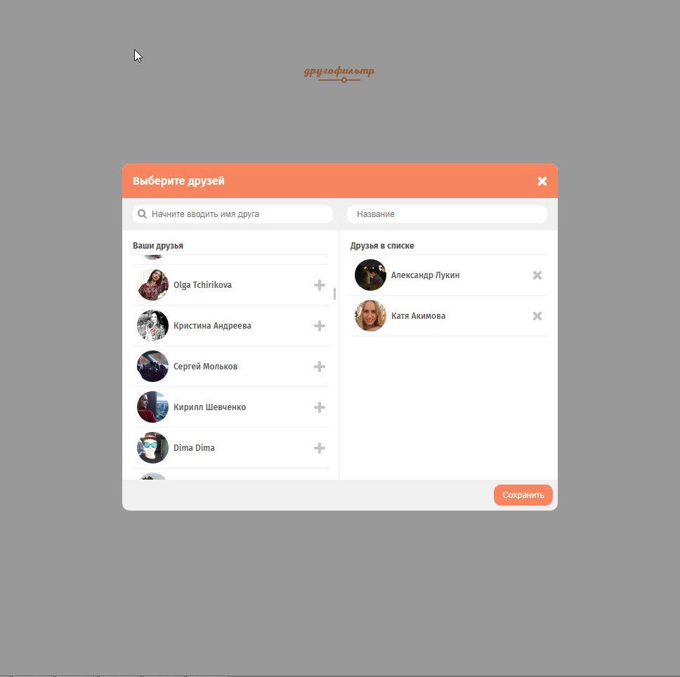

## LoftSchool другофильтр

	

### Доступные команды

* `npm install` - установить зависимости
* `npm run start` - запустить встроенный сервер и следить за изменениями файлов
* `npm run build` - собрать проект в папку `build`

### Функционал

* Загрузка списка друзей через VK Api
* Сортировка каждого списка по имени
* Возможность редактировать списки через кнопки или Drag'n'Drop
* Сохранение списков по кнопке

	

